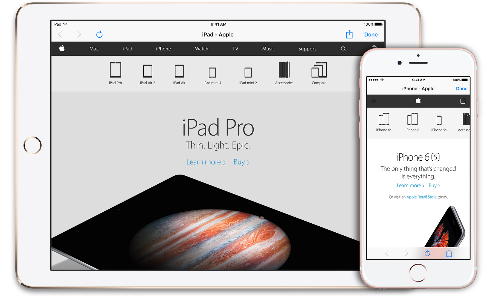

# react-native-browser
A full-featured web browser module for React Native apps, based on the awesome [TOWebViewController](https://github.com/TimOliver/TOWebViewController)



### Installation

1. Run `npm install react-native-browser --save` in your project directory.
- Open your project in XCode, right click on `Libraries` and click `Add Files to "Your Project Name"`
- Inside your node_modules, find react-native-browser and add `RCTBrowser.xcodeproj` to your project.
- Add `libRTCBrowser.a` to `Build Phases -> Link Binary With Libraries`
- Whenever you want to use it within your React code, you can: `var Browser = require('react-native-browser');`

### Usage

Example:

```
// at the top of your file near the other imports
var Browser = require('react-native-browser');

...


// wherever you want to trigger a browser modal appearing
Browser.open('https://google.com/');

// OR pass in options to customize
Browser.open('http://google.com/', {
                    showUrlWhileLoading: true,
                    navigationButtonsHidden: false,
                    showActionButton: true,
                    showDoneButton: true,
                    doneButtonTitle: 'Done',
                    showPageTitles: true,
                    disableContextualPopupMenu: false,
                    hideWebViewBoundaries: false
                  });
```

[Descriptions of options and their defaults](https://github.com/TimOliver/TOWebViewController/blob/master/TOWebViewController/TOWebViewController.h)

### TODOs

- [ ] Finish adding all customization options / support callbacks
- [ ] Custom tint color for navigation bar on modal
- [ ] Accessors for webview & url requests
- [ ] Programatic control of loading pages, closing the view, etc

### License

[MIT License](https://github.com/PrestoDoctor/react-native-browser/blob/master/LICENSE)